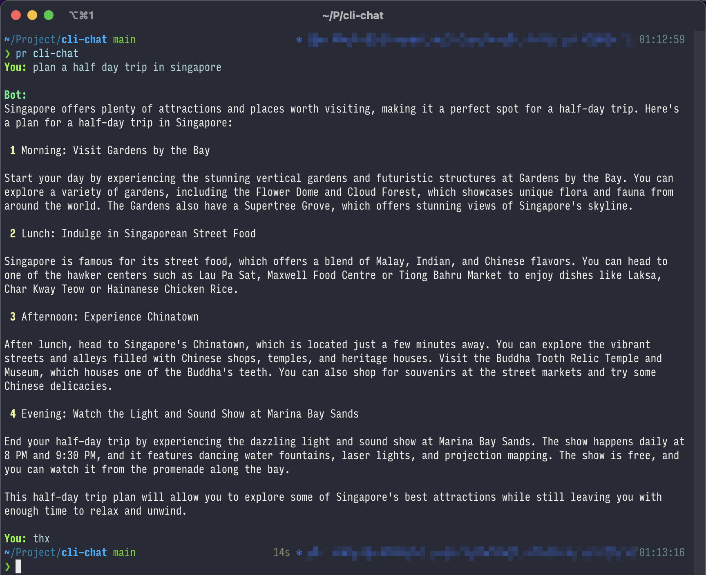
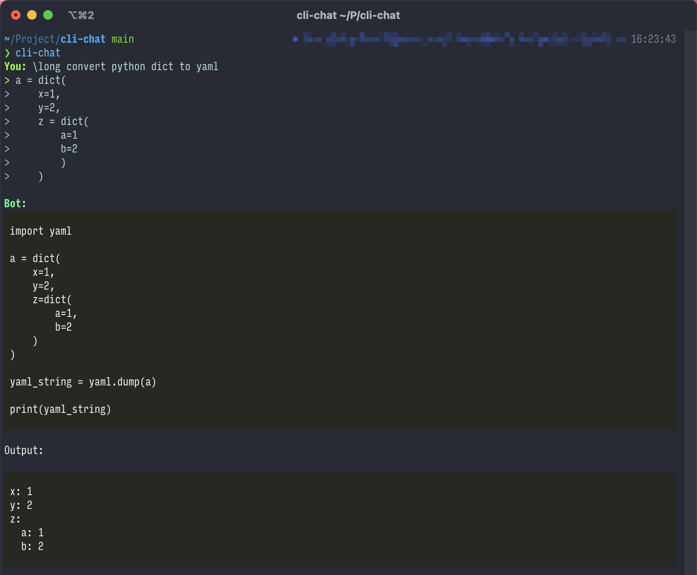
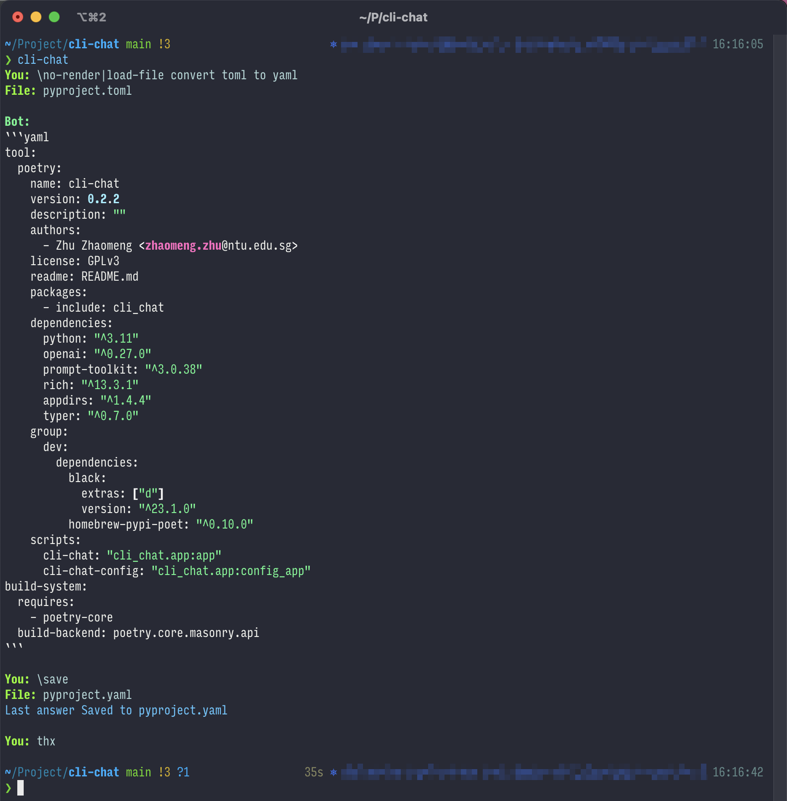

# cli-chat

`cli-chat` is a command-line tool that allows you to have a conversation with ChatGPT from your terminal.
Follow the simple steps below to install and use this tool.

## Installation

You can easily install `cli-chat` by typing the following command in your terminal:

```bash
pip install cli-chat
```

Alternatively, you can clone the repository and install the dependencies using `poetry`. Follow the steps below:

1. Clone the repository.
2. Run `poetry install`.

## Usage

To start a conversation, simply type the following command in your terminal:

```bash
cli-chat
```

Alternatively, start the script using `poetry` by typing the following command in your terminal:

```bash
poetry run cli-chat
```

Here are a few things to keep in mind when using `cli-chat`:

* Before using the tool, you must obtain an API key from [here](https://platform.openai.com/account/api-keys).
* The API key will be saved in a file named `.key` in your current directory. To change the key or stop using the tool,
  simply delete this file.
* You can use arrow keys to navigate through your conversation history.
* To end the conversation, type "thanks", "thx", or a similar phrase.
* Common key-bindings and auto-suggestions are supported, thanks
  to [prompt_toolkit](https://github.com/prompt-toolkit/python-prompt-toolkit).

### Control Sequences

You can use special control sequences to modify the behavior of the tool. A sequence is always placed at the beginning
of your question string and starts with a backslash `\`.

The following control sequences are available:

| Sequence        | Description                                                                                                                                   |
|-----------------|-----------------------------------------------------------------------------------------------------------------------------------------------|
| `\no-render`    | Do not render the answer's markdown.                                                                                                          |
| `\load-file`    | Load a file and use its contents as the remaining of the question.                                                                            |
| `\long`         | Accept multi-line inputs starting from now on. Use <kbd>Meta</kbd>+<kbd>Enter</kbd> or <kbd>ESC</kbd> followed by <kbd>Enter</kbd> to finish. |
| `\save`         | Save the last answer to a file.                                                                                                               |
| `\hide-answer`  | Do not show the answer. **Danger: If you want to save the answer later, always check it.**"                                                   |

You can use multiple control sequences at once by separating them with commas. For example, `\no-render,load-file` will
load a file and not render its contents as markdown.

## Example

Here are a couple of examples of what a conversation with `cli-chat` might look like:





