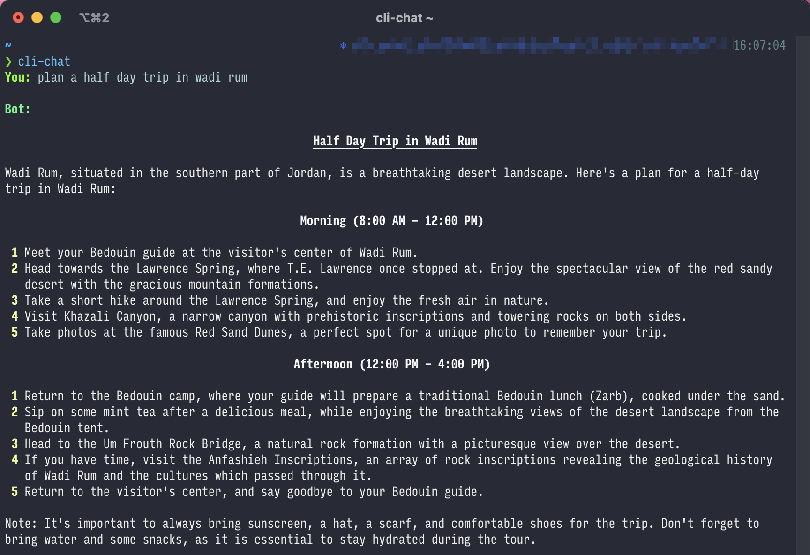
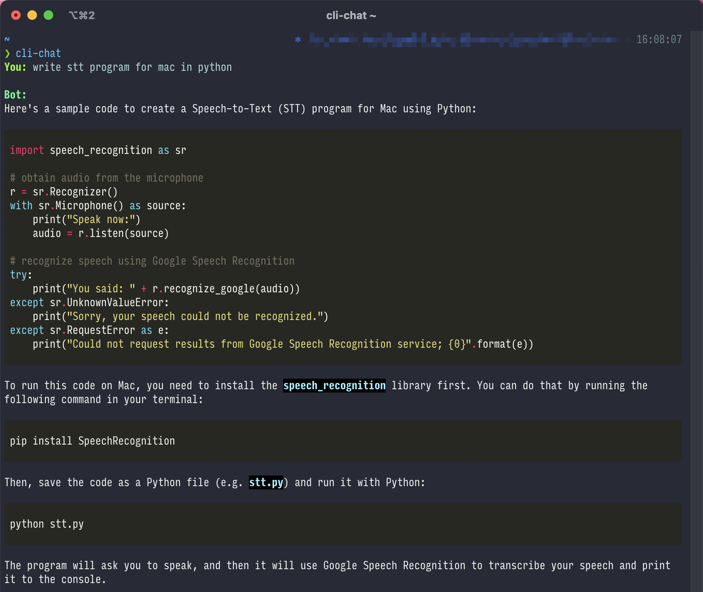
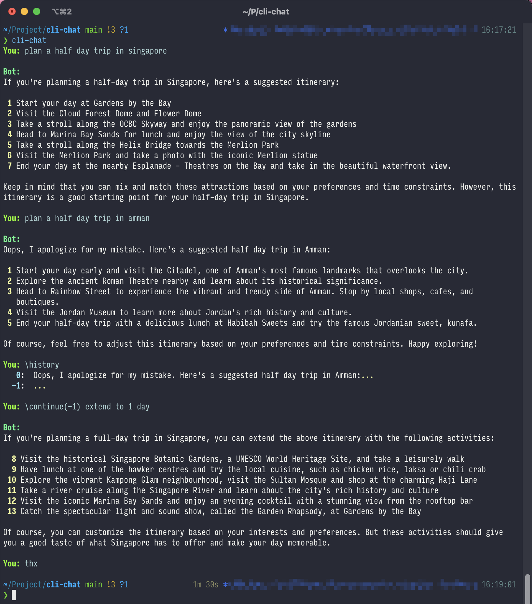

# `cli-chat`

`cli-chat` is a command-line tool that allows you to have a conversation with ChatGPT from your terminal. 

## Documentation

The documentation for `cli-chat` can be found [here](https://github.com/Tefx/cli-chat).

## Installation

### Mac

`cli-chat` can be installed on Mac using [Homebrew](https://brew.sh/). To install `cli-chat` using Homebrew,
simply execute the following command in your terminal:

```bash
brew tap tefx/tap
brew install cli-chat
```

### Other Platforms

To install `cli-chat`, execute the following command in your terminal:

```bash
pip install cli-chat
```

Alternatively, you can clone the repository and install the dependencies using `poetry`. Here are the steps to follow:

1. Install [poetry](https://python-poetry.org/docs/#installation).
2. Clone the repository.
3. Navigate to the repository's root directory.
4. Execute `poetry install`.

## Usage

To start a conversation with ChatGPT, execute the following command in your terminal:

```bash
cli-chat
```

Or, you can start the script in poetry's virtual environment:

```bash
poetry run cli-chat
```

Here are a few things to keep in mind when using `cli-chat`:

- Before being able to use the tool, you must obtain an API key by registering for
  it [here](https://platform.openai.com/account/api-keys).
- To end the conversation, type `thanks`, `thx`, `tq`, or a similar phrase.
- You can navigate through your conversation history with the arrow keys.
- Common key-bindings and auto-suggestions are supported, thanks
  to [prompt_toolkit](https://github.com/prompt-toolkit/python-prompt-toolkit).

### Control Commands

You can use special control commands to modify `cli-chat`'s behavior. These commands should be placed at the
beginning of your question string and should start with a backslash.

The supported control commands are listed below:

| Command       | Arguments | Tags             | Description                                                                                                                                                    |
|---------------|-----------|-----------------|----------------------------------------------------------------------------------------------------------------------------------------------------------------|
| `\no-render`  |           |                 | Prevent the answer from being rendered in markdown.                                                                                                            |
| `\load-file`  |           |                 | Load a file and use the contents as the remaining part of your question.                                                                                        |
| `\long`       |           |                 | Accept multi-line inputs from now on. Use <kbd>Meta</kbd>+<kbd>Enter</kbd> or <kbd>ESC</kbd> followed by <kbd>Enter</kbd> to finish.                           |
| `\save`       |           | `append`        | Save the last answer to a file.                                                                                                                                |
| `\hide-answer`|           |                 | Do not show the answer. **WARNING: Always check the answer first toavoid losing it if you want to save it later.**                                           |
| `\continue`   | `idx`     |                 | Resume the conversation from a previous answer. `idx` should be a negative number as shown by the `\history` command.                                         |
| `\forget`     |           |                 | Delete your conversation history.                                                                                                                              |
| `\history`    |           |                 | Show your entire conversation history.                                                                                                                         |

You can combine multiple control commands by separating them with `|`. For instance, `\no-render|load-file` will load a
file and prevent the answer from being rendered in markdown.

For some commands, additional arguments and tags may be specified by using the
syntax `command(arg1, arg2, ...){tag1, tag2, ..}`. For example, `\save{append}` will append the answer to the file
instead of overwriting it, while `\continue(-1)` will resume the conversation from the answer with index `-1` in the
history.

### Example

Here are a few examples of what a conversation with `cli-chat` might look like:

1. Show answer in markdown
   
   

2. Multi-line input
   

3. Not rendering the answer in markdown, loading a file, and saving the answer to a file
   

4. Check answer history and continue from a previous answer
   

## Configuration

Use `cli-chat-config` to manage key and input history.

## TODO

- [ ] Add autocomplete for control commands.
- [ ] Add support for prompt shortcuts.